# open-cx-t7g5-5-estrelinhas Development Report

Welcome to the documentation pages of the Meetix of **openCX**!

* Business modeling
  * [Product Vision](#Product-Vision)
  * [Elevator Pitch](#Elevator-Pitch)
* Requirements
  * [Use Case Diagram](#Use-case-diagram)
  * [User stories](#User-stories)
  * [Domain model](#Domain-model)
* Architecture and Design
  * [Logical architecture](#Logical-architecture)
  * [Physical architecture](#Physical-architecture)
  * [Prototype](#Prototype)
* [Implementation](#Implementation)
* [Test](#Test)
* [Configuration and change management](#Configuration-and-change-management)
* [Project management](#Project-management)

Please contact us!

Thank you!

Ana Teresa Cruz | up201806460@fe.up.pt

André Nascimento  | up201806461@fe.up.pt

António Bezerra | up201806854@fe.up.pt

Mariana Truta | up201806543@fe.up.pt

Rita Peixoto  | up201806257@fe.up.pt

---

# Business modeling

## Product Vision

Meetix is an app for easy online conference networking. The app allows attendees to see and like each other's profiles and get notified when they match, providing meaningful connections.

---

## Elevator Pitch

Online conferences provide us the chance to hear from speakers anywhere in the world without getting off the couch. However, networking is often overlooked. 

Meetix sets out to solve this problem with an incredibly simple approach. 

**Conference organizers** can register their event in less than 30 seconds. Just add basic information and relevant topics and you're up and running.

The same goes for **attendees** - no complex forms or weird links. Find your conference and create a profile with relevant contact info and interests. A few taps later, you're able to see, filter and like other profiles and get notified when you match with someone.

Meetix focuses on meaningful connections, no bells, and whistles.

---

# Requirements

## Use Case Diagram

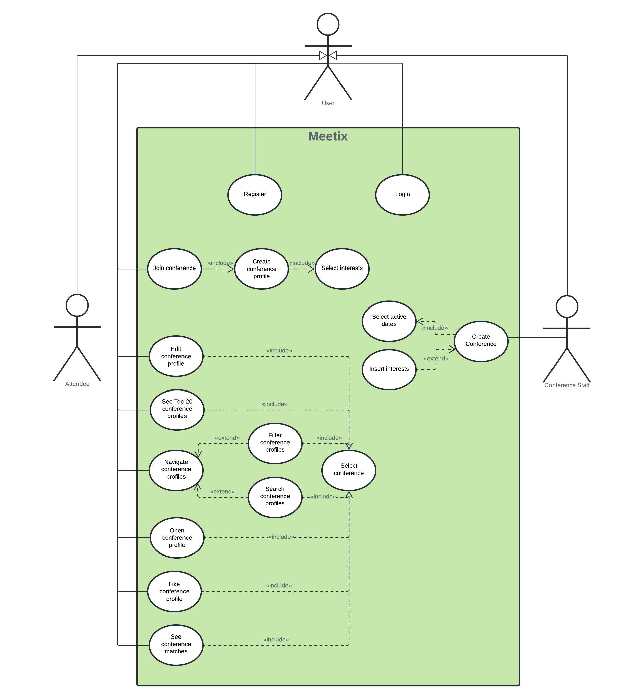

### Register account

* **Actor:** User

* **Description:** To use the app, all users must create an account before adhering to any conference and setting up a personal profile for that conference. This process consists simply of choosing an e-mail and password for future logins.

* **Preconditions and Postconditions:** The only precondition is to have the app installed on the device. Since this use case assumes the user has no account prior to this step, the program is left in a state where it requires the user to create an account.

* **Normal Flow:**
  1. User provides an e-mail.
  2. User provides a password.

* **Alternative Flows and Exceptions:**
  E-mail not linked to an existing account.
  E-mail must comply with the format email@example.com.
  If any of these conditions aren’t met, the user will not be able to create an account and the register button won’t be available.

### Login

* **Actor:** User

* **Description:** In order to use the app, all users must log in before adhering to any conference. This process consists simply of inputting the correct e-mail and password combination to access the user's account.

* **Preconditions and Postconditions:** The only precondition is to have already an account in the app. Afterward, the app is completely available for the user.

* **Normal Flow:**
  1. User provides an e-mail.
  2. User provides a password.

* **Alternative Flows and Exceptions:**
  E-mail and password combination correct.
  If this condition isn't met, the user will not be able to log in to the app.
  
### Create conference

* **Actor:** Conference Staff

* **Description:** For an attendee to join a conference, the conference must already exist and be available in the app. The process of creating a conference consists of inputting the data for that conference.

* **Preconditions and Postconditions:** The only precondition is to be logged in to the app. When the creation of the conference is done successfully, then it appears on the available conferences to the other users.

* **Normal Flow:**
  1. Staff provides a name.
  2. Staff provides the start and end dates.
  3. Staff provides a photo.
  4. Staff provides the topics list.

### Join conference

* **Actor:** User

* **Description:** In order to fully use the app, a user must join a conference. This process consists of clicking on available conferences on the menu search conferences, creating the profile for that conference, and selecting the topics they’re interested in.

* **Preconditions and Postconditions:** The only precondition is to be logged in to the app. Then the user has full access to all available features such as joining a conference. After joining and creating the profile, the user can enter the conference workspace.

* **Normal Flow:**
  1. The user selects a conference.
  2. The user provides the data for their conference profile.
  3. The user selects the interests of the provided list.

### Edit conference profile

* **Actor:** User

* **Description:** If they wish so, the user can change the information displayed on their conference profile, with the possibility to add, remove, or change any attributes on their profile.

* **Preconditions and Postconditions:** To edit a profile, the user must be in the conference workspace, and in their profile choose the edit button. Now that the profile was updated the user experience will be adjusted to their new information.

* **Normal Flow:**

  1. User opens the conference workspace and on their profile page, clicks the edit button.
  2. A form with the current information and possibilities to add new information or remove information will open.
  3. The user will edit their profile according to their will.
  4. The user hits save and their information will appear updated throughout the app.

* **Alternative Flows and Exceptions:** If the user does not wish to update can click the cancel button. The inserted information needs to be valid to be saved.

### See top20 conference profiles

* **Actor:** User

* **Description:** The user can view the top20 profiles that match the most with their conference profile.

* **Preconditions and Postconditions:** The user must have a profile with at least one interest in order to match other user interests.

* **Normal Flow:**
  1. When in a conference workspace, the user should go to the see top 20 page.

  2. A list with the top 20 profiles that match the most with the user will appear.

  3. The user is able to see each one of those profiles and like them.

### Navigate conference profiles

* **Actor:** User

* **Description:** After the user is in a conference workspace, it is possible to search and filter other profiles for the same conference.

* **Preconditions and Postconditions:** The user must be logged in.

* **Normal Flow:**
  1. In the conference workspace, the user clicks on the "Profiles" button to see all the profiles for that conference.
  2. The user can search for specific profiles or add filters to the list.

### Open conference profile

* **Actor:** User

* **Description:** When in a list of profiles of the conference or when searching for profiles, the user can open someone’s profile.

* **Preconditions and Postconditions:** The user must be in a conference workspace searching/viewing the list of profiles. After opening the profile, the user can see the display of the profile with the corresponding information.

* **Normal Flow:**

  1. Out of a list of profiles, the user clicks on one of the profiles.

  2. The profile opens up and the user can view it.

### Like conference profile

* **Actor:** User

* **Description:** In order to match with other profiles, the user must like the profiles they would like to connect with.

* **Preconditions and Postconditions:** The user must be in someone’s profile and have joined that conference. After this, the other user will be able to see that this user liked their profile.

* **Normal Flow:**

  1. The attendee enters someone’s profile.

  2. Clicks on the like button.

### See conference matches

* **Actor:** User

* **Description:** After liking someone's profile, that user can "like back", creating a match. The user can view the profiles that matched theirs.

* **Preconditions and Postconditions:** To be able to have matches the user must have liked profiles before.

* **Normal Flow:**
  1. The user must be in a conference workspace and click on the "Matches" page.
  2. Their matches will be displayed.

---

## User Stories


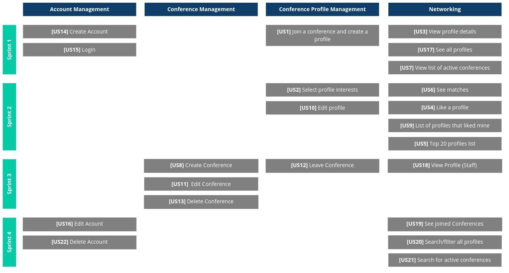


* [Story 1: Join conference and create a profile](#story-1-join-conference-and-create-a-profile)

* [Story 2: Select profile interests](#story-2-select-profile-interests)

* [Story 3: View profile details](#story-3-view-profile-details)

* [Story 4: Like a profile](#story-4-like-a-profile)

* [Story 5: Top 20 profiles list](#story-5-top-20-profiles-list)

* [Story 6: See matches](#story-6-see-matches)

* [Story 7: View list of active conferences](#story-7-view-list-of-active-conferences)

* [Story 8: Create conference](#story-8-create-conference)

* [Story 9: List of profiles that liked mine](#story-9-list-of-profiles-that-liked-mine)

* [Story 10: Edit profile](#story-10-edit-profile)

* [Story 11: Edit conference](#story-11-edit-conference)

* [Story 12: Leave conference](#story-12-leave-conference)

* [Story 13: Delete conference](#story-13-delete-conference)

* [Story 14: Create account](#story-14-create-account)

* [Story 15: Login](#story-15-login)

* [Story 16: Edit account](#story-16-edit-account)

* [Story 17: See all profiles](#story-17-see-all-profiles)

* [Story 18: View profile (Staff)](#story-18-view-profile-staff)

* [Story 19: See joined conferences](#story-19-see-joined-conferences)

* [Story 20: Search/Filter all profiles](#story-20-searchfilter-all-profiles)

* [Story 21: Search for active conferences](#story-21-search-for-active-conferences)

* [Story 22: Delete account](#story-22-delete-account)

### **Story 1: Join a conference and create a profile**

As a conference attendee, I want to be able to join a conference and create my conference profile, so that I can use the app's main features.

_User interface mockups_

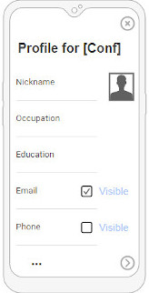

_Acceptance Tests_

```gherkin
Scenario: Joining a conference
Given I’m trying to join a conference
When I click on the conference event
Then the system opens a page for me to create my conference profile
When I complete this form with my information and interests, clicking the "Next" button
Then the system adds me to that conference’s attendee list, saving my information for matching purposes
```

```gherkin
Scenario: Not adding an image
Given I'm creating my profile
When I do not upload any image and click the "Next" button
Then the system assigns me a default image
```

_Value/Effort_

Value: Must have

Effort: M

---

### **Story 2: Select profile interests**

As a conference attendee, I want to be able to choose the topics I’m interested in so that I can see profiles that have similar interests to mine.

_User interface mockups_

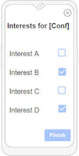

_Acceptance Tests_

```gherkin
Scenario: Joining a conference
Given I’m trying to join a conference
When I'm filling the form with my information
Then the system opens an alert dialog where it allows me to choose the topics of the conference I’m interested in
When I choose the interests and click the "Submit" button
Then I expect to see the chosen interests in the form 
When I click on the "Next" button
Then the system saves my information for matching purposes
```

```gherkin
Scenario: Joining a conference and not selecting interests 
Given I’m trying to join a conference
When I'm filling the form with my information
Then the system opens an alert dialog where it allows me to choose the topics of the conference I’m interested in
When I do not choose any interests and click the "Submit" button
Then I expect to see no interests in the form 
When I click on the "Next" button
Then the system saves my information even though I can't use all the functionalities of the app
```

```gherkin
Scenario: Editing the conference profile
Given I’m trying to edit my profile
When I'm changing the interests field 
Then the system opens an alert dialog where it allows me to choose the topics of the conference I’m interested in
When I choose the interests and click the "Submit" button
Then I expect to see the chosen interests in the form 
When I click on the "Save changes" button
Then the system saves my new information 
```

```gherkin
Scenario: Editing the conference profile and not selecting interests
Given I’m trying to edit my profile
When I'm changing the interests field 
Then the system opens an alert dialog where it allows me to choose the topics of the conference I’m interested in
When I choose no interests and click the "Submit" button
Then I expect to see no interests in the form 
When I click on the "Save changes" button
Then the system saves my information even though I can't use all the functionalities of the app 
```

_Value/Effort_

Value: Must have

Effort: L

---

### **Story 3: View profile details**

As a user, I want to be able to open a person’s profile to see its information, so that I can see my conference profile or another person's profile and decide if I'm interested or not.

_User interface mockups_

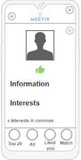
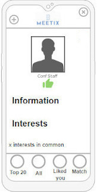

_Acceptance Tests_

```gherkin
Scenario: Visualize my conference profile
Given I’m logged in, I have clicked on a conference and I’m on a screen that lists conference profiles
When I open the app drawer and click the "My Profile" button
Then the app opens my profile for that conference
```

```gherkin
Scenario: Visualize a person’s profile 
Given I’m logged in, I have clicked on a conference and I’m on a screen that lists conference profiles
When I click on someone's profile
Then the app opens the person's profile and shows me their information
```

_Value/Effort_

Value: Must have

Effort: M

---

### **Story 4: Like a profile**

As a conference attendee, I want to be able to like a person's profile, so that I can later be matched with this person.

_User interface mockups_


_Acceptance Tests_

```gherkin
Scenario: Like a person’s profile
Given I’m logged in, I have joined a conference and I’m in someone's profile
When I click the "Like" button,
Then the app registers the action and shows my profile on the other user's "Liked Me" page, and changes the button to "Liked"
```

```gherkin
Scenario: Like a person’s profile without having a personal profile
Given I’m logged in, I have clicked on a conference without creating a profile, and I’m in someone's profile
When I click the "Liked" button,
Then the app shows me a message that I have to create a profile to like someone's profile
```

_Value/Effort_

Value: Must have

Effort: M

---

### **Story 5: Top 20 profiles list**

As a conference attendee, I want to be able to see the top 20 profiles who have the most interests in common with me, so that I can view profiles that are more relevant to me.

_User interface mockups_

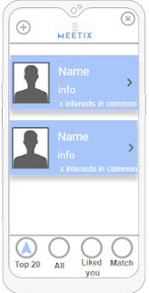

_Acceptance Tests_

```gherkin
Scenario: See top 20 profiles
Given I’m logged in and I have joined a conference,
When I click on the "Top 20" button located at bottom of the screen
Then the app shows me the top 20 profiles for this conference with whom I have the most interests in common
When I click on a profile,
Then the system sends me to the person’s profile
```

```gherkin
Scenario: See top 20 profiles having no interests selected
Given I’m logged in and I have joined a conference,
When I click on the "Top 20" button located at bottom of the screen and have no interests selected
Then the app shows me a message that there are no profiles to show
```

```gherkin
Scenario: See top 20 profiles without having a personal profile
Given I’m logged in and I have clicked on a conference without creating a profile,
When I click on the "Top 20" button located at bottom of the screen
Then the app shows me a message that there are no profiles to show
```

_Value/Effort_

Value: Must have

Effort: XL

---

### **Story 6: See matches**

As a conference attendee, I want to be able to see the profiles that have matched with me, so that I can know the people who liked me back.

_User interface mockups_

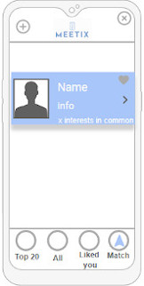

_Acceptance Tests_

```gherkin
Scenario: See profiles that I've matched with
Given I’m logged in and I have joined a conference,
When I click on the "Matches" button located at bottom of the screen
Then the app shows me the profiles that matched with me
When I click on a profile,
Then the system sends me to the person’s profile
```

```gherkin
Scenario: See profiles that I've matched with without having matches 
Given I’m logged in and I have joined a conference,
When I click on the "Matches" button located at bottom of the screen and I have no matches
Then the app shows me a message that I have no matches
```

```gherkin
Scenario: See profiles that I've matched with without having a personal profile
Given I’m logged in and I have clicked a conference without creating a profile,
When I click on the "Matches" button located at bottom of the screen
Then the app shows me a message that I have no matches
```

_Value/Effort_

Value: Must Have

Effort: M

---

### **Story 7: View list of active conferences**

As a user, I want to be able to view all active conferences, so that I might join them.

_User interface mockups_

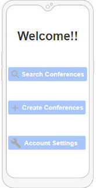
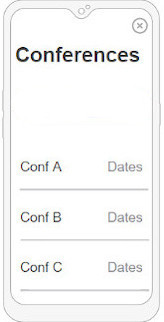

_Acceptance Tests_

```gherkin
Scenario: View all conferences
Given I’m logged in
When I open the app drawer and I click the "Available conferences" button
Then the app shows me a list of conferences available
```

```gherkin
Scenario: View all conferences having no conferences happening
Given I’m logged in and no conferences are happening
When I open the app drawer and I click the "Available conferences" button
Then I expect to see a message telling me that there are no active conferences
```

_Value/Effort_

Value: Must Have

Effort: S

---

### **Story 8: Create conference**

As a conference staff, I want to be able to create a conference, set its active dates, photo and insert the topics list, so that the conference becomes available to be joined by users.

_User interface mockups_


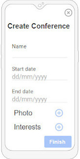

_Acceptance Tests_

```gherkin
Scenario: Creating a conference
Given I’m logged in
When I open the app drawer and I click the "Create conference" button
Then the app takes me to a form where I enter the conference details
When I finish inputting data
Then the app saves the conference and shows me the conference list page
```

```gherkin
Scenario: Creating a conference and inserting invalid dates
Given I'm inserting the start and end dates
When I insert an end date that's before the start date and I click the create conference button
Then the app warns me that the information is invalid and does not allow me to create a conference
```

```gherkin
Scenario: Creating a conference and not adding topics
Given I'm inserting the conference topics
When I click the create conference button with no topics added 
Then the app does not allow me to create a conference
```

_Value/Effort_

Value: Should Have

Effort: L

---

### **Story 9: List of profiles that liked mine**

As a conference attendee, I want to be able to see the profiles that have liked mine, so that I can potentially match them.

_User interface mockups_

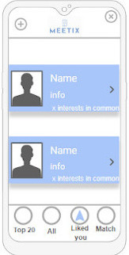

_Acceptance Tests_

```gherkin
Scenario: Seeing who liked my profile
Given I’m logged in and I have joined a conference,
When I click on the "Liked You" button located at bottom of the screen
Then the app shows me the profiles that liked mine
When I click on a profile,
Then the system sends me to the person’s profile
```

```gherkin
Scenario: Seeing who liked my profile and having no other attendee liking me
Given I’m logged in and I have joined a conference,
When I click on the "Liked You" button located at bottom of the screen
Then the app shows me a message that I have no other attendee liking me
```

```gherkin
Scenario: See who liked my profile without having a personal profile
Given I’m logged in and I have clicked a conference without creating a profile
When I click on the "Liked You" button located at bottom of the screen
Then the app shows me a message that I have no other attendee liking me
```


_Value/Effort_

Value: Should Have

Effort: M

---

### **Story 10: Edit profile**

As a conference attendee, I want to be able to edit my conference profile, changing my interests or any information displayed in my profile, so that it can be updated.

_User interface mockups_

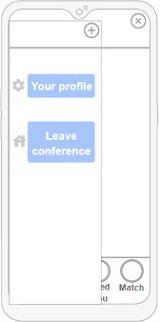

_Acceptance Tests_

```gherkin
Scenario: Editing my profile’s information
Given I’m in my profile
When I click on the edit button
Then I can edit my information
When I fill the form with all valid information that I want to change and I click the "Save changes" button
Then I expect the system to save my new information
```

```gherkin
Scenario: Editing my profile’s information and leaving some fields blank
Given I’m in my profile
When I click on the edit button
Then I can edit my information
When I fill the form and leave some fields blank and I click the "Save changes" button
Then I expect to see those fields remained the same
```

```gherkin
Scenario: Editing my profile’s information
Given I’m in my profile
When I click on the edit button
Then I can edit my information
When I click the "Cancel" button
Then I expect the system to not save any new information
```

_Value/Effort_

Value: Should Have

Effort: M

---

### **Story 11: Edit conference**

As conference staff, I want to be able to edit the conference I have created and change dates and topics so that all the information is up to date.

_User interface mockups_

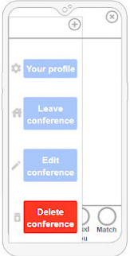

_Acceptance Tests_

```gherkin
Scenario: Edit conference
Given I’m logged in and I've opened a conference that I've created
When I open the app drawer and I click on the "Edit conference" button
Then the app shows a form to edit conference details
When I fill the form with all valid information that I want to change and I click the "Save changes" button
Then the app saves the changes
```

```gherkin
Scenario: Edit conference and leaving some fields blank
Given I’m logged in and I've opened a conference that I've created
When I open the app drawer and I click on the "Edit conference" button
Then the app shows a form to edit conference details
When I fill the form and leave some fields blank and I click the "Save changes" button
Then I expect to see those fields remained the same
```

```gherkin
Scenario: Edit conference
Given I’m logged in and I've opened a conference that I've created
When I open the app drawer and I click on the "Edit conference" button
Then the app shows a form to edit conference details
When I click the "Cancel" button
Then I expect the system to not save any new information
```

_Value/Effort_

Value: Should Have

Effort: M

---

### **Story 12: Leave conference**

As a conference attendee, I want to be able to leave a conference that I have joined so that I'm no longer an attendee for this conference and my profile is deleted.

_User interface mockups_


_Acceptance Tests_

```gherkin
Scenario: Leaving a conference
Given I’m logged in and I've opened a conference that I've joined
When I open the app drawer and I press the "Leave conference" button
Then the app shows me an alert dialog that asks for my confirmation
When I press the "Leave" button
Then the app deletes my registration and profile for this conference and takes me to the conferences list page
```

```gherkin
Scenario: Leaving a conference
Given I’m logged in and I've opened a conference that I've joined
When I open the app drawer and I press the "Leave conference" button
Then the app shows me an alert dialog that asks for my confirmation
When I press the "Cancel" button
Then I expect the system to remain the same
```

_Value/Effort_

Value: Should Have

Effort: S

---

### **Story 13: Delete conference**

As conference staff, I want to be able to delete the conference I have created, so that this conference is no longer available.

_User interface mockups_


_Acceptance Tests_

```gherkin
Scenario: Deleting a conference
Given I’m logged in and I've opened a conference that I've created
When I open the app drawer and I press the "Delete conference” button
Then the app shows me an alert dialog that asks for my confirmation
When I press the "Delete" button
Then the app deletes this conference and takes me to the conferences list page
```

```gherkin
Scenario: Deleting a conference
Given I’m logged in and I've opened a conference that I've created
When I open the app drawer and I press the "Delete conference” button
Then the app shows me an alert dialog that asks for my confirmation
When I press the "Cancel" button
Then I expect the system to remain the same
```

_Value/Effort_

Value: Should Have

Effort: S

---

### **Story 14: Create account**

As a user, I create an account in Meetix, so that I have access to all the available features.

_User interface mockups_

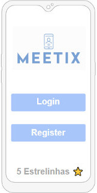
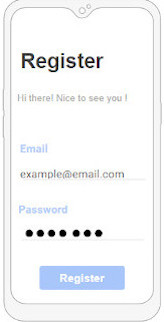

_Acceptance Tests_

```gherkin
Scenario: Trying to create an account
When I click on the "Sign up" button of the init menu
Given my email is valid and has no account associated with it yet
When I enter a password and press the button register
Then I expect my account to be created
```

```gherkin
Scenario: Trying to create an account
When I click on the "Sign up" button of the init menu
Given my email is already associated with an account
When I try to press the button register
Then I expect to not be able to create the account with a message warning me why
```

```gherkin
Scenario: Trying to create an account
When I click on the "Sign up" button of the init menu
Given my email is not valid
When I try to press the button register
Then I expect to not be able to create the account with a message warning me why
```

_Value/Effort_

Value: Should Have

Effort: M

---

### **Story 15: Login**

As a user, I want to be able to log in to the app, so that I can use all the available features.

_User interface mockups_


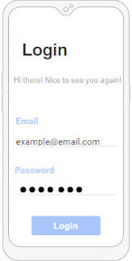

_Acceptance Tests_

```gherkin
Scenario: Log in
When I click on the "Sign in" button of the init menu
Given a correct email and password combination
When I press the "Sign in" button
Then I expect to be able to log in to the account
```

```gherkin
Scenario: Log in
When I click on the "Sign in" button of the init menu
Given either one of my email or password isn’t valid
When I press the "Sign in" button
Then I expect to not be able to log in to the account, with a message warning me why
```

_Value/Effort_

Value: Should Have

Effort: S

---

### **Story 16: Edit account**

As a user, I want to be able to edit my account (change email/password), so that I can change my information.

_User interface mockups_


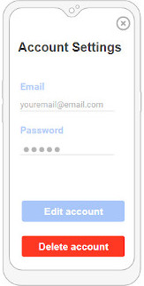

_Acceptance Tests_

```gherkin
Scenario: Edit account
Given I’m logged in and I'm on the conferences list page
When I open the app drawer and I click on the "Account settings" button
Then the app shows me my account editable
When I change my email, password, or username with valid information and the current password is correct and I click on the "Save changes" button
Then the app updates my account
```

```gherkin
Scenario: Edit account
Given I’m logged in and I'm on the conferences list page
When I open the app drawer and I click on the "Account settings" button
Then the app shows me my account editable
When I change my email, password, or username with invalid information and the current password is correct and I click on the "Save changes" button
Then the app does not allow me to update my account and shows me an error telling me what's wrong
```

```gherkin
Scenario: Edit account
Given I’m logged in and I'm on the conferences list page
When I open the app drawer and I click on the "Account settings" button
Then the app shows me my account editable
When I leave some fields blank and I click on the "Save changes" button
Then these fields will not be updated
```

```gherkin
Scenario: Edit account
Given I’m logged in and I'm on the conferences list page
When I open the app drawer and I click on the "Account settings" button
Then the app shows me my account editable
When I edit some fields to the same values they were before and I click on the "Save changes" button
Then these fields will not be updated
```

```gherkin
Scenario: Edit account
Given I’m logged in and I'm on the conferences list page
When I open the app drawer and I click on the "Account settings" button
Then the app shows me my account editable
When I edit the email and this new email is already being used by another user and I click on the "Save changes" button
Then the app will not allow me to change my email and shows me an error telling me why
```

```gherkin
Scenario: Edit account
Given I’m logged in and I'm on the conferences list page
When I open the app drawer and I click on the "Account settings" button
Then the app shows me my account editable
When I edit the password and it's a weak password and I click on the "Save changes" button
Then the app will not allow me to change my password and shows me an error telling me why
```

_Value/Effort_

Value: Could Have

Effort: S

---

### **Story 17: See all profiles**

As a user, I want to be able to see all the profiles for a given conference, so that I can find profiles that interest me.

_User interface mockups_

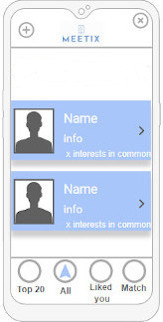

_Acceptance Tests_

```gherkin
Scenario: See all profiles
Given I’m logged in and I have clicked on a conference,
When I click on the "Profiles" button located at the bottom of the screen
Then the app shows me all profiles for this conference
```

```gherkin
Scenario: See all profiles and having no profiles for that conference created
Given I’m logged in and I have clicked on a conference,
When I click on the "Profiles" button located at the bottom of the screen and there are no profiles for that conference
Then the app shows me a message that there are no profiles for this conference 
```

_Value/Effort_

Value: Should Have

Effort: S

---

### **Story 18: View profile (Staff)**

As a conference staff, I want to see my profile with something that signals that I'm the conference staff so that users can also see that I'm the one who created the conference.

_User interface mockups_


_Acceptance Tests_

```gherkin
Scenario: View profiles
Given I'm in a conference workspace and I'm viewing users' profiles
When the user id matches the conference creator id 
Then the app shows me a conference staff profile
When I'm viewing a conference staff profile
Then the system shows me a profile similar to other users with something that signals that the user is a conference staff.
```

```gherkin
Scenario: View profiles.
Given I'm in a conference workspace and I'm viewing users' profiles
When the user id does not match the conference creator id 
Then the app shows me a regular conference profile with nothing that distinguishes what kind of user it is.
```

_Value/Effort_

Value: Could Have

Effort: S

---

### **Story 19: See joined/created conferences**

As a conference user, I want to be able to see the conferences I have joined/created and switch between them so that I can network in multiple conferences.

_User interface mockups_


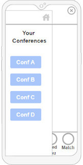

_Acceptance Tests_

```gherkin
Scenario: See joined conferences
Given I’m logged in
When I open the app drawer and I click on the "Joined conferences" button
Then the app shows me all the conferences that I've joined
When I click on the conference event
Then the app switches me to this conference’s workspace
```

```gherkin
Scenario: See joined conferences
Given I’m logged in and I have joined conferences without creating a profile,
When I open the app drawer and I click on the "Joined conferences" button
Then the app shows me a message that I have not joined any conferences
```

```gherkin
Scenario: See created conferences
Given I’m logged in
When I open the app drawer and I click on the "Created conferences" button
Then the app shows me all the conferences that I've created
When I click on the conference event
Then the app switches me to this conference’s workspace
```

```gherkin
Scenario: See created conferences
Given I’m logged in and I have not created any conferences,
When I open the app drawer and I click on the "Created conferences" button
Then the app shows me a message that I have not joined any conferences
```

_Value/Effort_

Value: Could Have

Effort: XL

---

### **Story 20: Search/Filter all profiles**

As a user, I want to be able to search/filter all the profiles for a given conference, so that I can have a selected view according to what I'm looking for.

_User interface mockups_

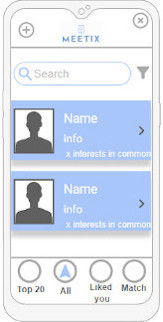

_Acceptance Tests_

```gherkin
Scenario: Search profiles
Given I’m logged in and I have joined a conference,
When I click on the "Profiles" button located at the bottom of the screen
Then the app shows me all profiles for this conference
When I click on the "Search bar" and insert a string,
Then the app shows me all profiles matching the string
```

```gherkin
Scenario: Filter profiles
Given I’m logged in and I have joined a conference,
When I click on the "Profiles" button located at the bottom of the screen
Then the app shows me all profiles for this conference
When I click on the "Filter button"
Then the app shows me all filters
When I click "Filter"
Then the app shows me all profiles matching the applied filters
When I click on a profile,
Then the system sends me to the person’s profile
```

_Value/Effort_

Value: Could Have

Effort: L/XL

---

### **Story 21: Search for active conferences**

As a conference attendee, I want to be able to search for a specific conference by name or interests, so that I can easily find what I'm looking for.

_User interface mockups_


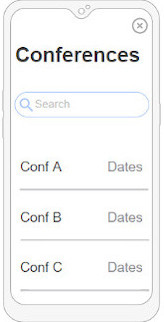

_Acceptance Tests_

```gherkin
Scenario: Searching for conferences
Given I’m logged in
When I click the button to search for active conferences to join
Then the app shows me a page with a search bar
When I click on the "Search bar" and insert a string to search for either the conference name or interests,
Then the app shows me all active conferences matching the string if any
```


_Value/Effort_

Value: Could Have

Effort: S/M

---

### **Story 22: Delete account**

As a user, I want to be able to delete my account, so that I no longer can use this app.

_User interface mockups_


_Acceptance Tests_

```gherkin
Scenario: Deleting account
Given I’m logged in and I'm on the conferences list page
When I open the app drawer and I click on the "Account settings" button
Then the app shows me my account
When I click on the "Delete Account" button
Then the app shows me an alert dialog that asks for my confirmation and password
When I press the "Delete" button
Then the app deletes my account and all my information (photos, likes, etc.)
```

```gherkin
Scenario: Deleting account
Given I’m logged in and I'm on the conferences list page
When I open the app drawer and I click on the "Account settings" button
Then the app shows me my account
When I click on the "Delete Account" button
Then the app shows me an alert dialog that asks for my confirmation and password
When I press the "Delete" button and the password is not correct or empty
Then the app does not allow me to delete my account and shows me an error telling me why
```

```gherkin
Scenario: Deleting account
Given I’m logged in and I'm on the conferences list page
When I open the app drawer and I click on the "Account settings" button
Then the app shows me my account
When I click on the "Delete Account" button
Then the app shows me an alert dialog that asks for my confirmation
When I press the "Cancel" button
Then I expect the system to remain the same
```

```gherkin
Scenario: Deleting account
Given I’m logged in and I'm on the conferences list page and I'm staff in some conferences
When I open the app drawer and I click on the "Account settings" button
Then the app shows me my account
When I click on the "Delete Account" button
Then the app shows me an alert dialog that asks for my confirmation and password
When I press the "Delete" button
Then the app deletes my account and all my information (photos, likes, etc.) and also all the conferences I've created and all the information corresponding to these conferences
```

_Value/Effort_

Value: Could Have

Effort: S

---

## Domain model


The users of our app can either be attendees or staff. Staff is the person who creates the conference (1 - \*). When users join a conference, they have to create a profile (1 - 1), that will be their profile in that conference (\* - 1). Attendees can like other attendees (1 - \*) and if the like is mutual they match (1 - *).

---

# Architecture and Design

The architecture of a software system encompasses the set of key decisions about its overall organization.

The following topics refer to the logical and physical architecture, which will show the connection between each machine and the used technologies.

## Logical architecture

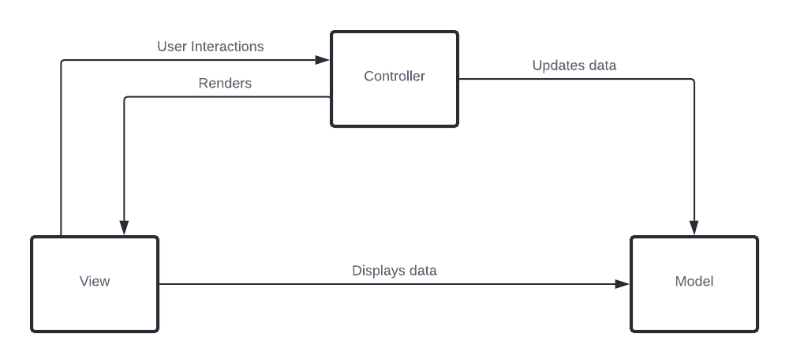

We decided to use the MVC architecture pattern which splits the code into three parts keeping the view, model, and controller independent of each other.

* The **Model** only contains the data such as the information about the conferences, user data, etc.

* The **View** displays this data, collects and sends user interactions to the Controller.

* The **Controller** is the brain of the app. It determines how data in the Model has changed accordingly to the actions reported by the View.

### Package diagram

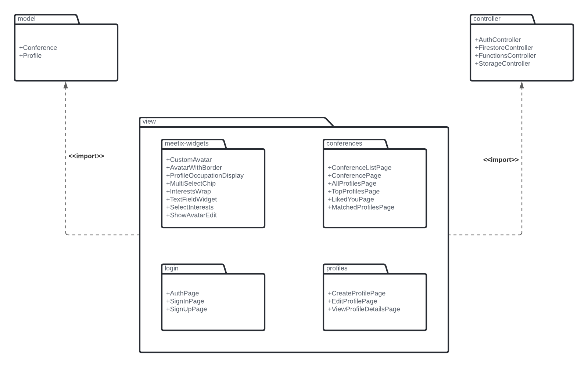

In this diagram it shows that we organized our applications into three big packages, corresponding to the MVC architecture parts. Besides that, since the view part is the biggest in our application we decided to also divide it into packages.

The first, meetix-widgets, is where we have the code for all the personalized widgets we've created. Then the login package has the pages that correspond to the account. There is, then, a conference package where all conference-related pages are kept. For last, the profiles package contains the pages that correspond to everything that concerns the profiles.

---

## Physical architecture

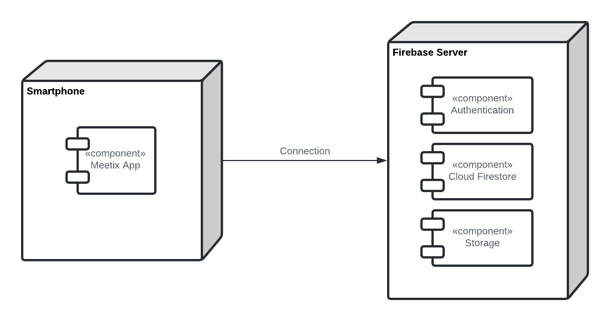

In this subsection, it is documented the high-level physical structure decisions made in our software system (machines, connections, software components installed, and their dependencies).

Before starting to implement the application, we needed to decide the programming language: Flutter was the obvious choice since it was recommended by the professors and is one of the most prominent mobile development frameworks.

For the database server, we chose Firebase as it is simple to set up and easy to integrate with Flutter.

The user installs the Meetix app on his smartphone, serving as a client and the app communicates, through HTTPS requests, with the firebase server where the database is stored, handling the communication of the API with it, accessing and adding all the information needed for the app's flow.

To allow the user to search through the database information, we connected to the Algolia server, a full-text search provider.

---

## Prototype

To help on validating all the architectural, design, and technological decisions made, we implemented a vertical prototype, a thin vertical slice of the system.

The prototype's role in our development process was about testing if the tool Flutter was adequate to do what we aimed to do and also about advancing the development of the app itself.

For the prototype, the main story was #6 which states that 'As a conference attendee, I want to be able to see the profiles that have matched with me'. The other ones serve as the base for the app.

# Implementation

Changelogs for the 4 different product increments can be found [here](https://github.com/FEUP-ESOF-2020-21/open-cx-t7g5-5-estrelinhas/releases)

# Test

To ensure the application works as intended, we implemented automated tests using flutter's testing framework and the [flutter_gherkin](https://pub.dev/packages/flutter_gherkin) package.

## Test Plan

### Flutter Widget Tests

We did not implement true unit tests, since our application offloads the bulk of the data processing needs to Firebase's Cloud Functions. Therefore, the unit tests we could implement in flutter, wouldn't be very meaningful, testing only getters for our model classes.

We opted instead to use flutter's widget tests framework to test how elements are displayed and laid out.  These are component tests that provide more meaningful results since they allow us to know if the information we get from both Cloud Firestore and Cloud Functions requests is being handled properly by the app.

The features to be tested are the following:

- Displaying a list of profiles
- Displaying a profile
- Displaying a list of conferences

We decided to test these features because they cover the bulk of the user's activities when using the app. They also provide good coverage of the occasions where we are displaying data from the aforementioned cloud services.

### Flutter Gherkin Tests

We used the [flutter_gherkin](https://pub.dev/packages/flutter_gherkin) package to automate some of our acceptance tests.

The features to be tested are the following:

- Logging into the app
- Logging out of the app
- Signing up for the app

We decided to test these features not necessarily because they are the most crucial to test, but because of the instability and limitations of the testing API. These were chosen as a good proof-of-concept for automating acceptance tests since, while simple, they require user interaction through both taps and text input.

## Test Case Specification

### Flutter Widget Tests

#### Displaying a list of profiles

These tests verify that when given a list of mock profiles, the app correctly displays their information. We achieve this by verifying if the app generates the correct text and icon elements for the given profiles. We also check that if the profile list is empty, the app displays the correct error.

#### Displaying a profile

These tests verify that when given a mock profile, the app correctly displays its information. We achieve this by verifying if the app generates the correct text and icon elements for the given profile. We also check that if the profile has some fields with null values, the app does not display unwanted tags.

#### Displaying a list of conferences

These tests verify that when given a list of mock conferences, the app correctly displays their information. We achieve this by verifying if the app generates the correct text and icon elements for the given conferences. We also check that if the conference list is empty, the app displays the correct error.

### Flutter Gherkin Tests

#### Logging into the app

These tests verify that when the user is logged out and in the "Sign In" page, they can log in successfully.
We achieve this by verifying that when a valid email and password combination is inserted, the app logs in the user and redirected them to a page that lists available conferences. We also check that if this combination is invalid, the app displays the correct warning message and stays on the "Sign In" page.

#### Logging out of the app

These tests verify that when the user is logged in and on a page that lists conferences, they can log out successfully. We achieved this by verifying that when the "Logout" button of the app drawer is pressed, the app redirects the user to the "Sign In" page.

#### Signing up for the app

These tests verify that when the user tries to create an account with an invalid email, the account is not created. We achieved this by verifying that when the user inserts an email that is already associated with an existing account or inserts a badly formatted email, the app stays on the "Sign Up" page and the respective warning message is shown.

# Configuration and change management

To control and maintain the integrity of our project's components(code, models, documents), configuration, and change management are key activities.

To manage feature requests, bug fixes, and improvements, we used GitHub issues, following the GitHub flow.

# Project management

The planning and management of our project were made using the Github Projects tool: https://github.com/FEUP-ESOF-2020-21/open-cx-t7g5-5-estrelinhas/projects/1.

Here we registered our tasks, assigned them to the team members, added estimations to tasks, and monitored their progress. This tool showed itself to be suitable for keeping track of our project.
