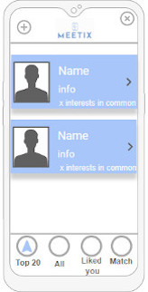
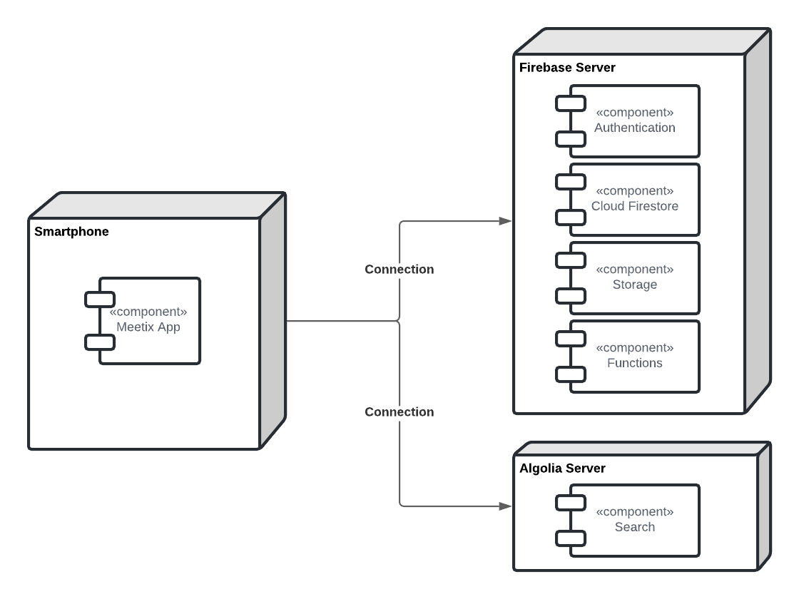

# open-cx-t7g5-5-estrelinhas Development Report

Welcome to the documentation pages of the Meetix of **openCX**!

* Business modeling 
  * [Product Vision](#Product-Vision)
  * [Elevator Pitch](#Elevator-Pitch)
* Requirements
  * [Use Case Diagram](#Use-case-diagram)
  * [User stories](#User-stories)
  * [Domain model](#Domain-model)
* Architecture and Design
  * [Logical architecture](#Logical-architecture)
  * [Physical architecture](#Physical-architecture)
  * [Prototype](#Prototype)
* [Implementation](#Implementation)
* [Test](#Test)
* [Configuration and change management](#Configuration-and-change-management)
* [Project management](#Project-management)

Please contact us!

Thank you!

Ana Teresa Cruz

André Nascimento

António Bezerra

Mariana Truta

Rita Peixoto

---
# Business modeling

## Product Vision

Let's connect throught our app, add your interests and efficiently connect with people with identical interests and network online.

---
## Elevator Pitch

---
# Requirements

## Use Case Diagram


---

## User Stories

### **Story 1: Join conference**

As a conference attendee, I want to be able to join a conference, creating my conference profile and choosing the topics I’m interested in.

_User interface mockups_


_Acceptance Tests_

```gherkin
Scenario: Joining a conference
Given I’m trying to join a conference
When I click on the conference event
Then the system opens a page for me to create my conference profile
When I complete this form 
Then the system allows me to choose the topics of the conference I’m interested in
When I click the ‘finish’ button
Then the system adds me to that conference’s attendee list, saving my information for matching purposes 
```

_Value/Effort_

Value: Must have

Effort: L

---
### **Story 2: View/Like profile**

As a conference attendee, I want to be able to open a person’s profile to like the profile and/or see its information.

_User interface mockups_


_Acceptance Tests_

```gherkin
Scenario: Visualize a person’s profile
Given I’m logged-in, I have a joined a conference, and I’m on a screen that lists profiles,
When I click someone's profile,
Then the app opens the person's profile and shows me the visible information.

Scenario: Like a person’s profile
Given I’m logged-in, I have joined a conference and I’m in someone's profile.
When I click the “like” button,
Then the app registers the action and shows my profile in the other users "Liked Me" page
```
_Value/Effort_

Value: Must have

Effort: M

---
### **Story 3: Top 20**

As a conference attendee, I want to be able to see the top 20 profiles who have the most interests in common with me.

_User interface mockups_



_Acceptance Tests_
```gherkin
Scenario: See top 20 profiles
Given I’m logged-in and I have joined a conference,
When I click on the “Top 20” button located at bottom of the screen
Then the app shows me the top 20 profiles for this conference with whom I have the most interests in common 
When I click on a profile,
Then the system sends me to the person’s profile
```
_Value/Effort_

Value: Must have

Effort: XL

---
### **Story 4: See matches**

As a conference attendee, I want to be able to see the profiles that have matched with me.

_User interface mockups_


_Acceptance Tests_
```gherkin
Scenario: See profiles that I've matched with
Given I’m logged-in and I have joined a conference,
When I click on the “Matches” button located at bottom of the screen
Then the app shows me the profiles that matched with me
When I click on a profile,
Then the system sends me to the person’s profile
```
_Value/Effort_

Value: Must Have

Effort: M

---
### **Story 5: View/Search conferences**

As a conference attendee, I want to be able to search and view active conferences.

_User interface mockups_


_Acceptance Tests_
```gherkin
Scenario: Searching for conferences
Given I’m logged-in
When I click the button to search for conferences to join
Then the app shows me a list of conferences available

Scenario: Searching for conferences
Given no conferences are happening
When I check the available conferences
Then I expect to see no conferences availables to join
```
_Value/Effort_

Value: Must Have

Effort: S

---
### **Story 6: Create conference**

As a conference staff, I want to be able to create a conference, set its active dates, photo and insert the interests list.

_User interface mockups_


_Acceptance Tests_
```gherkin
Scenario: Creating a conference
Given I’m logged-in
Then the app shows me a menu of options
When I click the ‘Create conference’ button
Then the app takes me to a form where I enter the conference details
When I finish inputting data
Then the app saves the conference.
```
_Value/Effort_

Value: Should Have

Effort: L

---
### **Story 7: See likes**

As a conference attendee, I want to be able to see the profiles that have liked mine.

_User interface mockups_


_Acceptance Tests_
```gherkin
Scenario: Seeing who liked my profile
Given I’m logged-in and I have joined a conference,
When I click on the “Liked You” button located at bottom of the screen
Then the app shows me the profiles that liked mine
When I click on a profile,
Then the system sends me to the person’s profile
```
_Value/Effort_

Value: Should Have

Effort: M

---
### **Story 8: Edit profile**

As a conference attendee, I want to be able to edit my conference profile, changing my interests or any information displayed in my profile.

_User interface mockups_


_Acceptance Tests_
```gherkin
Scenario: Editing my profile’s information
Given I’m logged-in, I have joined a conference and opened the sidebar menu
When I click on “Your profile” button of the sidebar
Then the app shows me my profile
When I click on the edit button
Then I can edit my information
```
_Value/Effort_

Value: Should Have

Effort: M

---
### **Story 9: Edit conference**

As conference staff, I want to be able to edit the conference I have created and change dates and interests.

_User interface mockups_


_Acceptance Tests_
```gherkin
Scenario: Edit conference
Given I’m logged-in, I’ve joined a conference and opened the sidebar menu
When I click on the “Edit conference” button of the sidebar
Then the app shows a form to edit conference details.
When I click the save button
Then the app saves the changes.
```
_Value/Effort_

Value: Should Have

Effort: M

---
### **Story 10: Leave conference**

As a user, I want to be able to leave a conference that I have joined.

_User interface mockups_


_Acceptance Tests_
```gherkin
Scenario: Leaving a conference
Given I’m logged-in, I have a joined a conference and opened the sidebar menu
When I press the “Leave conference” button of the sidebar
Then the app deletes my registration and profile for this conference and takes me to another conference's workspace or to the Welcome screen, in case there is none.
```
_Value/Effort_

Value: Should Have

Effort: S

---
### **Story 11: Delete conference**

As conference staff, I want to be able to delete the conference I have created.

_User interface mockups_


_Acceptance Tests_
```gherkin
Scenario: Deleting a conference
Given I’m logged-in, I’ve joined a conference and opened the sidebar menu.
When I press the “Delete conference” button of the sidebar
Then the app deletes the conference’s information.
```
_Value/Effort_

Value: Should Have

Effort: S

---
### **Story 12: Create account**

As a user, I create an account in Meetix, so that I have access to all the available features.

_User interface mockups_


_Acceptance Tests_
```gherkin
Scenario: Trying to create an account
When I click on the "Register" button of the init menu
Given my email is already associated with an account
When I try to press the button register, 
Then I expect to not be able to create the account with a message warning me why

Scenario: Trying to create an account
When I click on the "Register" button of the init menu
Given my email is not valid
When I try to press the button register, 
Then I expect to not be able to create the account with a message warning me why

Scenario: Trying to create an account
When I click on the "Register" button of the init menu
Given my email is valid and has not been used in this app
When I try to press the button register,
Then I expect to be able to create an account
```
_Value/Effort_

Value: Should Have

Effort: M

---
### **Story 13: Login**

As a user, I want to be able to login to the app.

_User interface mockups_


_Acceptance Tests_
```gherkin
Scenario: Login
When I click on the "Login" button of the init menu
Given a correct email and password combination
When I press the “Login” button, 
Then I expect to be able to login the account

Scenario: Login
When I click on the "Login" button of the init menu
Given either one of my email or password isn’t valid
When I press the “Login” button, 
Then I expect to not be able to login the account, with a message warning me why
```
_Value/Effort_

Value: Should Have

Effort: S

---
### **Story 14: Delete/Edit account**

As a user, I want to be able to delete or edit my account (change email/password).

_User interface mockups_


_Acceptance Tests_
```gherkin
Scenario: Edit account
Given I’m logged-in and in the “Welcome” menu
When I click on the “Account settings” button
Then the app shows a screen with my account information
When I click on the “Edit” button
Then I can edit my email/password
When I click on the “Delete account” button
Then my account and all associated profiles are deleted
```
_Value/Effort_

Value: Could Have

Effort: M

---
### **Story 15: See all profiles**

As a conference attendee, I want to be able to see all the profiles and search/filter them.

_User interface mockups_


_Acceptance Tests_
```gherkin
Scenario: Search profiles
Given I’m logged-in and I have joined a conference,
When I click on the “All” button located at the bottom of the screen
Then the app shows me all profiles for this conference
When I click on the “Search bar” and insert a string,
Then the app shows me all profiles matching the string

Scenario: Filter profiles
Given I’m logged-in and I have joined a conference,
When I click on the “All” button located at the bottom of the screen
Then the app shows me all profiles for this conference
When I click on the “Filter button” 
Then the app shows me all filters.
When I click "Filter"
Then the app shows me all profiles matching the applied filters.
When I click on a profile,
Then the system sends me to the person’s profile
```
_Value/Effort_

Value: Could Have

Effort: L/XL

---
### **Story 16: Create profile**

As a conference staff, I want to create a profile for the conference I have just created.

_Acceptance Tests_
```gherkin
Scenario: Creating a staff profile.
Given I have finished creating the conference
When I click the ‘finish’ button
Then the system opens a page for me to create my conference profile
When I complete this form 
Then the system allows me to choose the topics of the conference I’m interested in
When I click the ‘finish’ button
Then the system adds me to that conference’s attendee list, saving my information for matching purposes 
```
_Value/Effort_

Value: Could Have

Effort: M

---
### **Story 17: See joined conferences**

As a conference attendee, I want to be able to see the conferences I have joined and switch between them.

_User interface mockups_


_Acceptance Tests_
```gherkin
Scenario: Seeing and switching between conferences
Given I’m logged-in and I have a joined a conference
When I open the sidebar and I click on “+” button
Then the app shows me all my conferences
When I choose a conference
Then the apps switches me to this conference’s profile workspace
```
_Value/Effort_

Value: Could Have

Effort: XL

---
## Domain model

---
# Architecture and Design

The architecture of a software system encompasses the set of key decisions about its overall organization.

The following topics refer to the logical and physical architecture, which will show the connection between each machine and the used technologies.

## Logical architecture


We decided to use the MVC architecture pattern which splits the code in three parts keeping the view, model and controller independent of each other.

- The **Model** only contains the data such as the information about the conferences, user data, etc. 

- The **View** displays this data, collects and sends user interactions to the Controller. 

- The **Controller** is the brain of the app. It determinates how data in the Model is changed accordingly to the actions reported by the View.

### Package diagram


---
## Physical architecture



Before starting to implement the application, we needed to decide the programming language: Flutter was the obvious choice, since it was recommended by the professors and is one of the most prominent mobile development frameworks.

For the database server we chose Firebase as it is simple to setup and easy to integrate with Flutter.

---
## Prototype

To help on validating all the architectural, design and technological decisions made, we implemented a vertical prototype, a thin vertical slice of the system.

The prototype's role in our development proccess was about testing if the tool Flutter was adequate to do what we aimed to do and also about advancing the development of the app itself.

For the prototype the main story was #4 which states that 'As a conference attendee, I want to be able to see the profiles that have matched with me'. The other ones serve as base for the app.

# Implementation

# Test

# Configuration and change management

# Project management