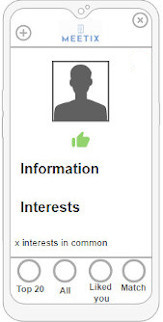
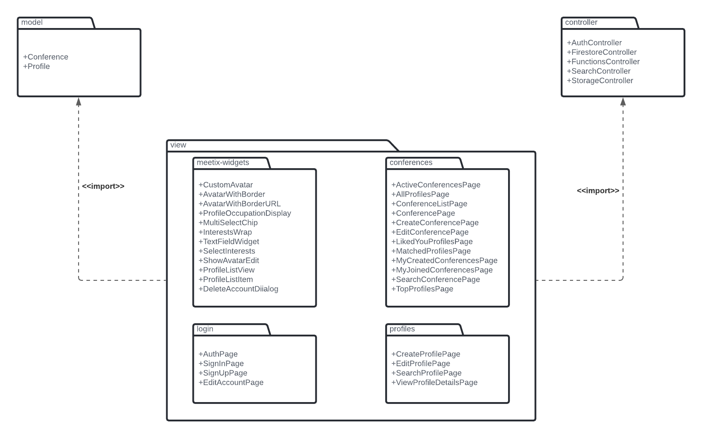

# open-cx-t7g5-5-estrelinhas Development Report

Welcome to the documentation pages of the Meetix of **openCX**!

* Business modeling
  * [Product Vision](#Product-Vision)
  * [Elevator Pitch](#Elevator-Pitch)
* Requirements
  * [Use Case Diagram](#Use-case-diagram)
  * [User stories](#User-stories)
  * [Domain model](#Domain-model)
* Architecture and Design
  * [Logical architecture](#Logical-architecture)
  * [Physical architecture](#Physical-architecture)
  * [Prototype](#Prototype)
* [Implementation](#Implementation)
* [Test](#Test)
* [Configuration and change management](#Configuration-and-change-management)
* [Project management](#Project-management)

Please contact us!

Thank you!

Ana Teresa Cruz | up201806460@fe.up.pt

André Nascimento  | up201806461@fe.up.pt

António Bezerra | up201806854@fe.up.pt

Mariana Truta | up201806543@fe.up.pt

Rita Peixoto  | up201806257@fe.up.pt

---

# Business modeling

## Product Vision

We want to make networking in the ever more common online conferences easier. Users select a conference they're attending and can see other attendees with similar interests to theirs. Once two profiles match, they can share contact information. With Meetix, connections are easier and more meaningful than ever.

---

## Elevator Pitch

Online conferences provide us the chance to hear from speakers anywhere in the world without getting yourself off the couch. However, networking is a victim here. 

In these circumstances, there aren't many opportunities to reach out to business leaders or potential employers.

To make this easier for you,  Meetix  allows you to match with other conference users with similar interests, making networking one tap away.
So let's connect through our app, add your interests and efficiently connect with people with identical interests and network online.

---

# Requirements

## Use Case Diagram


### Register account

* **Actor:** User

* **Description:** In order to use the app, all users must create an account before adhering to any conference and setting up a personal profile for that conference. This process consists simply of choosing an e-mail and password for future logins.

* **Preconditions and Postconditions:** The only precondition is to have the app installed on the device. Since this use case assumes the user has no account prior to this step, the program is left in a state where it requires the user to create an account.

* **Normal Flow:**
  1. User provides an e-mail.
  2. User provides a password.

* **Alternative Flows and Exceptions:**
  E-mail not linked to an existing account.
  E-mail must comply with the format email@example.com.
  If any of these conditions aren’t met, the user will not be able to create an account and the register button won’t be available.

### Login

* **Actor:** User

* **Description:** In order to use the app, all users must login before adhering to any conference. This process consists simply of inputting the correct e-mail and password combination to access the user's account.

* **Preconditions and Postconditions:** The only precondition is to have already an account in the app. Afterward, the app is completly available for the user.

* **Normal Flow:**
  1. User provides an e-mail.
  2. User provides a password.

* **Alternative Flows and Exceptions:**
  E-mail and password combination correct.
  If this condition isn't met, the user will not be able to login the app.
  
### Create conference

* **Actor:** Conference Staff

* **Description:** In order to an attendee join a conference, the conference must already exists and be available in the app. The process of creating a conference consists of inputting the data for that conference.

* **Preconditions and Postconditions:** The only precondition is to be logged in the app. When the creation of the conference is done successfully, then it appears on the available conferences to the other users.

* **Normal Flow:**
  1. Staff provides a name.
  2. Staff provides the start and end dates.
  3. Staff provides a photo.
  4. Staff provides the topics list.

### Join conference

* **Actor:** User

* **Description:** In order to fully use the app, an user must join a conference. This process consists on clicking on available conferences on the menu search conferences, creating the profile for that conference and selecting of the topics list their interests.

* **Preconditions and Postconditions:** The only precondition is to be logged in the app. Then the user has full acess to all available features such as joining a conference. After joining and creating the profile, the user can enter the conference workspace.

* **Normal Flow:**
  1. The user selects a conference.
  2. The user provides the data for the conference profile.
  3. The user selects the interests of the provided list.

### Edit conference profile

* **Actor:** User

* **Description:** If they wish so, the user can change the information displayed on their conference profile, with possibility to add, remove or change any attributes on their profile.

* **Preconditions and Postconditions:** To edit a profile, the user must be in the conference workspace and in their profile choose the edit button. Now that the profile was updated the user experience will be adjusted to their new information.

* **Normal Flow:**

  1. User opens the conference workspace and on their profile page, clicks the edit button.
  2. A form with the current information and possibilities to add new information or remove information will open.
  3. The user will edit their profile according to their will.
  4. The user hits save and their information will appear updated throughout the all app.

* **Alternative Flows and Exceptions:** If the user does not wish to update can click the cancel button. The  inserted information needs to be valid to be saved.

### See top20 conference profiles

* **Actor:** User

* **Description:** The user can view the top20 profiles that match the most with their conference profile.

* **Preconditions and Postconditions:** The user must have a profile with minimum information to be contacted in order to match other user interests.

* **Normal Flow:**
  1. When in a conference workspace, the user should go to the see top 20 page.

  2. A list with the top 20 profiles that match the most with the user will appear.

  3. The user is able to see each one of those profiles and like them.

### Navigate conference profiles

* **Actor:** User

* **Description:** After the user creates the profile for the conference, it is possible to search and filter other profiles for the same conference.

* **Preconditions and Postconditions:** The user must have a profile for the conference.

* **Normal Flow:**
  1. In the conference workspace, the user clicks on the “all” button to see all the profiles for that conference.
  2. The user can search for specific profiles or add filters to the list.

### Open conference profile

* **Actor:** User

* **Description:** When in a list of profiles of the conference or when searching for profiles, it’s possible for the user to open someone’s profile.

* **Preconditions and Postconditions:** The user must be in a conference workspace searching/viewing list of profiles. After opening the profile, the user is able to see the display of the profile with the corresponding information.

* **Normal Flow:**

  1. Out of a list of profiles, the user clicks on one of the profiles.

  2. The profile opens up and the user can view it.

### Like conference profile

* **Actor:** User

* **Description:** In order to match with other profiles, the user must like the profiles they would like to connect with.

* **Preconditions and Postconditions:** The user must be in someone’s profile. After this, the other user will be able to see that this user liked their profile.

* **Normal Flow:**

  1. The attendee enters someone’s profile.

  2. Clicks on the like button.

### See conference matches

* **Actor:** User

* **Description:** After liking someone's profile, that user can “like back", creating a match. The user can view the profiles that matched theirs.

* **Preconditions and Postconditions:** To be able to have matches the user must have liked profiles before.

* **Normal Flow:**
  1. The user must be in a conference workspace and click on the “matches” page.
  2. Their matches will be displayed.

---

## User Stories

* [Story 1: Join conference and create a profile](#story-1-join-conference-and-create-a-profile)

* [Story 2: Select profile interests](#story-2-select-profile-interests)

* [Story 3: View profile details](#story-3-view-profile-details)

* [Story 4: Like a profile](#story-4-like-a-profile)

* [Story 5: Top 20 profiles list](#story-5-top-20-profiles-list)

* [Story 6: See matches](#story-6-see-matches)

* [Story 7: View list of active conferences](#story-7-view-list-of-active-conferences)

* [Story 8: Create conference](#story-8-create-conference)

* [Story 9: List of profiles that liked mine](#story-9-list-of-profiles-that-liked-mine)

* [Story 10: Edit profile](#story-10-edit-profile)

* [Story 11: Edit conference](#story-11-edit-conference)

* [Story 12: Leave conference](#story-12-leave-conference)

* [Story 13: Delete conference](#story-13-delete-conference)

* [Story 14: Create account](#story-14-create-account)

* [Story 15: Login](#story-15-login)

* [Story 16: Delete/Edit account](#story-16-deleteedit-account)

* [Story 17: See all profiles](#story-17-see-all-profiles)

* [Story 18: View profile (Staff)](#story-18-view-profile-staff)

* [Story 19: See joined conferences](#story-19-see-joined-conferences)

* [Story 20: Search/Filter all profiles](#story-20-searchfilter-all-profiles)

* [Story 21: Search for active conferences](#story-21-search-for-active-conferences)

### **Story 1: Join conference and create a profile**

As a conference attendee, I want to be able to join a conference and create my conference profile.

_User interface mockups_


_Acceptance Tests_

```gherkin
Scenario: Joining a conference
Given I’m trying to join a conference
When I click on the conference event
Then the system opens a page for me to create my conference profile
When I complete this form
Then the system allows me to choose the topics of the conference I’m interested in
When I click the ‘finish’ button
Then the system adds me to that conference’s attendee list, saving my information for matching purposes and adding me to that conference's attendee list

Scenario: Not adding an image
Given I'm creating my profile
When I do not upload any image and click the 'finish' button
Then the system assigns me a default image

```

_Value/Effort_

Value: Must have

Effort: M

---

### **Story 2: Select profile interests**

As a conference attendee, I want to be able to choose the topics I’m interested in.

_User interface mockups_


_Acceptance Tests_

```gherkin
Scenario: Joining a conference
Given I’m trying to join a conference
When I'm filling the form with my information
Then the system opens an alert dialog where it allows me to choose the topics of the conference I’m interested in
When I choose the interests and click the 'submit' button
Then I expect to see the choosen interests in the form 
When I click on the 'finish' button
Then the system saves my information for matching purposes
```

```gherkin
Scenario: Joining a conference
Given I’m trying to join a conference
When I'm filling the form with my information
Then the system opens an alert dialog where it allows me to choose the topics of the conference I’m interested in
When I do not choose any interests and click the 'submit' button
Then I expect to see no interests in the form 
When I click on the 'finish' button
Then the system saves my information even though I can't use all the funcitionalities of the app
```
```gherkin
Scenario: Editing the conference profile
Given I’m trying to edit my profile
When I'm changing the interests field 
Then the system opens an alert dialog where it allows me to choose the topics of the conference I’m interested in
When I choose the interests and  click the 'submit' button
Then I expect to see the choosen interests in the form 
When I click on the 'save' button
Then the system saves my new information 
```
```gherkin
Scenario: Editing the conference profile
Given I’m trying to edit my profile
When I'm changing the interests field 
Then the system opens an alert dialog where it allows me to choose the topics of the conference I’m interested in
When I choose no the interests and  click the 'submit' button
Then I expect to see no interests in the form 
When I click on the 'save' button
Then the system saves my information even though I can't use all the funcitionalities of the app 
```

_Value/Effort_

Value: Must have

Effort: L

---

### **Story 3: View profile details**

As an user, I want to be able to open a person’s profile to see its information.

_User interface mockups_



_Acceptance Tests_

```gherkin
Scenario: Visualize a person’s profile
Given I’m logged-in, I have a joined a conference and I’m on a screen that lists profiles,
When I click someone's profile,
Then the app opens the person's profile and shows me the visible information
```

_Value/Effort_

Value: Must have

Effort: M

---

### **Story 4: Like a profile**

As an user, I want to be able to like a person's profile.

_User interface mockups_


_Acceptance Tests_

```gherkin
Scenario: Like a person’s profile
Given I’m logged-in, I have joined a conference and I’m in someone's profile.
When I click the “like” button,
Then the app registers the action and shows my profile in the other users "Liked Me" page
```

_Value/Effort_

Value: Must have

Effort: M

---

### **Story 5: Top 20 profiles list**

As an user, I want to be able to see the top 20 profiles who have the most interests in common with me.

_User interface mockups_


_Acceptance Tests_

```gherkin
Scenario: See top 20 profiles
Given I’m logged-in and I have joined a conference,
When I click on the “Top 20” button located at bottom of the screen
Then the app shows me the top 20 profiles for this conference with whom I have the most interests in common
When I click on a profile,
Then the system sends me to the person’s profile
```

_Value/Effort_

Value: Must have

Effort: XL

---

### **Story 6: See matches**

As an user, I want to be able to see the profiles that have matched with me.

_User interface mockups_


_Acceptance Tests_

```gherkin
Scenario: See profiles that I've matched with
Given I’m logged-in and I have joined a conference,
When I click on the “Matches” button located at bottom of the screen
Then the app shows me the profiles that matched with me
When I click on a profile,
Then the system sends me to the person’s profile
```

_Value/Effort_

Value: Must Have

Effort: M

---

### **Story 7: View list of active conferences**

As a conference attendee, I want to be able to view all active conferences.

_User interface mockups_


_Acceptance Tests_

```gherkin
Scenario: View all conferences
Given I’m logged-in
When I click the button to search for conferences to join
Then the app shows me a list of conferences available

Scenario: View all conferences
Given I’m logged-in and no conferences are happening
When I click the button to search for conferences to join
Then I expect to see no conferences available
```

_Value/Effort_

Value: Must Have

Effort: S

---

### **Story 8: Create conference**

As a conference staff, I want to be able to create a conference, set its active dates, photo and insert the interests list.

_User interface mockups_


_Acceptance Tests_

```gherkin
Scenario: Creating a conference
Given I’m logged-in
Then the app shows me a menu of options
When I click the ‘Create conference’ button
Then the app takes me to a form where I enter the conference details
When I finish inputting data
Then the app saves the conference and shows me the conference list page

Scenario: Inserting invalid dates
Given I'm inserting the start and end dates
When I insert an end date that's before the start date and I click the create conference button
Then the app warns me that the information is invalid and does not allow me to create a conference

Scenario: Creating a conference
Given I'm inserting the conference interests
When I click the create conference button with no interests selected 
Then the app does not allow me to create a conference

```

_Value/Effort_

Value: Should Have

Effort: L

---

### **Story 9: List of profiles that liked mine**

As an user, I want to be able to see the profiles that have liked mine.

_User interface mockups_


_Acceptance Tests_

```gherkin
Scenario: Seeing who liked my profile
Given I’m logged-in and I have joined a conference,
When I click on the “Liked You” button located at bottom of the screen
Then the app shows me the profiles that liked mine
When I click on a profile,
Then the system sends me to the person’s profile
```

_Value/Effort_

Value: Should Have

Effort: M

---

### **Story 10: Edit profile**

As an user, I want to be able to edit my conference profile, changing my interests or any information displayed in my profile.

_User interface mockups_


_Acceptance Tests_

```gherkin
Scenario: Editing my profile’s information
Given I’m in my profile
When I click on the edit button
Then I can edit my information
When I fill the form with all valid information I want to change and I click the 'save' button
Then I expect the system to save my new information
```

```gherkin
Scenario: Editing my profile’s information
Given I’m in  my profile
When I click on the edit button
Then I can edit my information
When I fill the form and some of the new information isn't valid and I click the 'save' button
Then I expect to not be able to save the new information with a message warning me why
```

_Value/Effort_

Value: Should Have

Effort: M

---

### **Story 11: Edit conference**

As conference staff, I want to be able to edit the conference I have created and change dates and interests.

_User interface mockups_


_Acceptance Tests_

```gherkin
Scenario: Edit conference
Given I’m logged-in, I’ve joined a conference and opened the sidebar menu
When I click on the “Edit conference” button of the sidebar
Then the app shows a form to edit conference details.
When I click the save button
Then the app saves the changes.
```

_Value/Effort_

Value: Should Have

Effort: M

---

### **Story 12: Leave conference**

As an user, I want to be able to leave a conference that I have joined.

_User interface mockups_


_Acceptance Tests_

```gherkin
Scenario: Leaving a conference
Given I’m logged-in, I have a joined a conference and opened the sidebar menu
When I press the “Leave conference” button of the sidebar
Then the app deletes my registration and profile for this conference and takes me to another conference's workspace or to the Welcome screen, in case there is none.
```

_Value/Effort_

Value: Should Have

Effort: S

---

### **Story 13: Delete conference**

As conference staff, I want to be able to delete the conference I have created.

_User interface mockups_


_Acceptance Tests_

```gherkin
Scenario: Deleting a conference
Given I’m logged-in, I’ve joined a conference and opened the sidebar menu.
When I press the “Delete conference” button of the sidebar
Then the app deletes the conference’s information.
```

_Value/Effort_

Value: Should Have

Effort: S

---

### **Story 14: Create account**

As an user, I create an account in Meetix, so that I have access to all the available features.

_User interface mockups_


_Acceptance Tests_

```gherkin
Scenario: Trying to create an account
When I click on the "Register" button of the init menu
Given my email is already associated with an account
When I try to press the button register,
Then I expect to not be able to create the account with a message warning me why

Scenario: Trying to create an account
When I click on the "Register" button of the init menu
Given my email is not valid
When I try to press the button register,
Then I expect to not be able to create the account with a message warning me why

Scenario: Trying to create an account
When I click on the "Register" button of the init menu
Given my email is valid and has not been used in this app
When I try to press the button register,
Then I expect to be able to create an account
```

_Value/Effort_

Value: Should Have

Effort: M

---

### **Story 15: Login**

As an user, I want to be able to login to the app.

_User interface mockups_


_Acceptance Tests_

```gherkin
Scenario: Login
When I click on the "Login" button of the init menu
Given a correct email and password combination
When I press the “Login” button,
Then I expect to be able to login the account

Scenario: Login
When I click on the "Login" button of the init menu
Given either one of my email or password isn’t valid
When I press the “Login” button,
Then I expect to not be able to login the account, with a message warning me why
```

_Value/Effort_

Value: Should Have

Effort: S

---

### **Story 16: Delete/Edit account**

As an user, I want to be able to delete or edit my account (change email/password).

_User interface mockups_


_Acceptance Tests_

```gherkin
Scenario: Edit account
Given I’m logged-in and in the “Welcome” menu
When I click on the “Account settings” button
Then the app shows a screen with my account information
When I click on the “Edit” button
Then I can edit my email/password
When I click on the “Delete account” button
Then my account and all associated profiles are deleted
```

_Value/Effort_

Value: Could Have

Effort: M

---

### **Story 17: See all profiles**

As an user, I want to be able to see all the profiles for a given conference.

_User interface mockups_


_Acceptance Tests_

```gherkin
Scenario: Search profiles
Given I’m logged-in and I have joined a conference,
When I click on the “All” button located at the bottom of the screen
Then the app shows me all profiles for this conference
```

_Value/Effort_

Value: Should Have

Effort: S

---

### **Story 18: View profile (Staff)**

As a conference staff, I want to see my profile with something that signals that I'm the conference staff, so that users can also see that I've created the conference.

_Acceptance Tests_

```gherkin
Scenario: View a staff profile.
Given I'm in a conference workspace and I'm viewing users profiles
When the user id matches the conference creator id 
Then the app shows me a conference staff profile
When I'm viewing a conference staff profile
Then the system shows me a profile similar to others users with something that signals that user is a conference staff.
```

_Value/Effort_

Value: Could Have

Effort: S

---

### **Story 19: See joined conferences**

As a conference attendee, I want to be able to see the conferences I have joined and switch between them.

_User interface mockups_


_Acceptance Tests_

```gherkin
Scenario: Seeing and switching between conferences
Given I’m logged-in and I have a joined a conference
When I open the sidebar and I click on “+” button
Then the app shows me all my conferences
When I choose a conference
Then the apps switches me to this conference’s profile workspace
```

_Value/Effort_

Value: Could Have

Effort: XL

---

### **Story 20: Search/Filter all profiles**

As an user, I want to be able to search/filter all the profiles for a given conference.

_User interface mockups_


_Acceptance Tests_

```gherkin
Scenario: Search profiles
Given I’m logged-in and I have joined a conference,
When I click on the “All” button located at the bottom of the screen
Then the app shows me all profiles for this conference
When I click on the “Search bar” and insert a string,
Then the app shows me all profiles matching the string

Scenario: Filter profiles
Given I’m logged-in and I have joined a conference,
When I click on the “All” button located at the bottom of the screen
Then the app shows me all profiles for this conference
When I click on the “Filter button”
Then the app shows me all filters
When I click "Filter"
Then the app shows me all profiles matching the applied filters
When I click on a profile,
Then the system sends me to the person’s profile
```

_Value/Effort_

Value: Could Have

Effort: L/XL

---

### **Story 21: Search for active conferences**

As a conference attendee, I want to be able to search for a specific conference by name.

_User interface mockups_


_Acceptance Tests_

```gherkin
Scenario: Searching for conferences
Given I’m logged-in
When I click the button to search for conferences to join
Then the app shows me a page with a search bar
When I click on the “Search bar” and insert a string,
Then the app shows me all conferences matching the string

Scenario: Searching for conferences
Given I’m logged-in
When I click the button to search for conferences to join
Then the app shows me a page with a search bar
When I input the name of a conference that does not exist
Then I expect to see no results
```

_Value/Effort_

Value: Could Have

Effort: S/M

---

## Domain model

---

# Architecture and Design

The architecture of a software system encompasses the set of key decisions about its overall organization.

The following topics refer to the logical and physical architecture, which will show the connection between each machine and the used technologies.

## Logical architecture


We decided to use the MVC architecture pattern which splits the code in three parts keeping the view, model and controller independent of each other.

* The **Model** only contains the data such as the information about the conferences, user data, etc.

* The **View** displays this data, collects and sends user interactions to the Controller.

* The **Controller** is the brain of the app. It determinates how data in the Model is changed accordingly to the actions reported by the View.

### Package diagram



---

## Physical architecture


Before starting to implement the application, we needed to decide the programming language: Flutter was the obvious choice, since it was recommended by the professors and is one of the most prominent mobile development frameworks.

For the database server we chose Firebase as it is simple to setup and easy to integrate with Flutter.

---

## Prototype

To help on validating all the architectural, design and technological decisions made, we implemented a vertical prototype, a thin vertical slice of the system.

The prototype's role in our development proccess was about testing if the tool Flutter was adequate to do what we aimed to do and also about advancing the development of the app itself.

For the prototype the main story was #4 which states that 'As a conference attendee, I want to be able to see the profiles that have matched with me'. The other ones serve as base for the app.

# Implementation

# Test

# Configuration and change management

# Project management